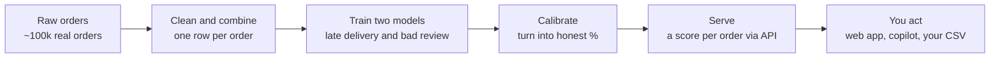
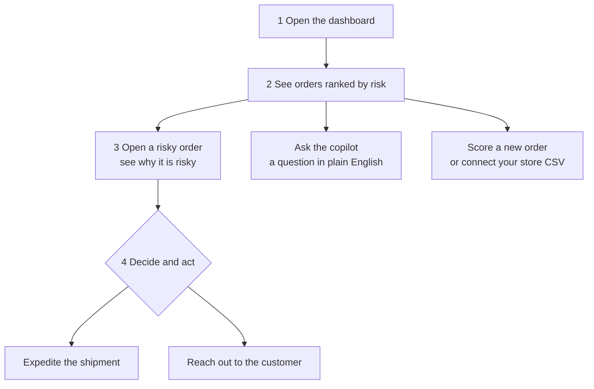

# How Veridian works — in plain English

No machine-learning or engineering background needed. This page explains **what
Veridian does, how it works, and how a team gets value from it** in everyday
language. (For the technical deep-dive, see [`ARCHITECTURE.md`](ARCHITECTURE.md)
and [`MODEL_CARD.md`](MODEL_CARD.md).)

---

## In one sentence

> Veridian looks at every online order and predicts whether it will **arrive late**
> or leave the customer **unhappy** — so the team can fix the order *before* the
> customer is let down.

## The problem it solves

When you sell online, some orders go wrong: the parcel arrives late, or the
customer leaves a 1–2★ review. Today most teams only find out **after** it
happens — once the refund, the angry email, or the bad rating has already landed.

But the warning signs are usually there at checkout: a tight delivery promise, a
buyer far from the warehouse, a tricky product category. Veridian reads those
signs and turns them into a simple **risk score per order**, so you can act while
it still matters.

## What you actually get

- A **ranked list of orders most likely to go wrong**, updated as you score them.
- For each order, a **plain risk level** — Low / Medium / High — and the
  percentage behind it.
- The **reasons** an order looks risky (e.g. "long distance + short delivery
  promise"), so the score is never a black box.
- An **AI copilot** you can ask questions in plain English ("which states have the
  worst delays?").
- Your **own orders scored** — paste or upload a CSV and get a risk for each.

---

## How it works (the pipeline)

Think of it as a five-step assembly line that turns raw order history into a
score you can act on:

1. **Raw orders** — we start from ~100k real past orders (the public Olist
   dataset), where we already know which ones ended up late or badly reviewed.
2. **Clean and combine** — messy source tables are joined into one tidy row per
   order, with the facts known at checkout (price, items, distance, delivery
   promise, category…).
3. **Train two models** — the system *learns the patterns* that led to late
   deliveries and to bad reviews, by studying those past orders.
4. **Calibrate** — we make sure a "20% risk" really means roughly 1-in-5, so the
   numbers can be trusted, not just ranked.
5. **Serve and act** — a small web service hands back a score for any order, and
   the web app, copilot, and your own CSV uploads all use it.

> **Why two models?** "Will it be late?" can be judged at checkout. "Will the
> review be bad?" partly depends on what happens *after* delivery — so it is kept
> as a separate, honestly-framed model.

---

## What you do (the user flow)

Everything runs in a guest demo — no sign-up. A typical session:

| Step | Page | What you do |
|---|---|---|
| 1–2 | **Dashboard** | See the whole order book scored and ranked; spot the risky ones at a glance. |
| 3 | **Order detail** | Open any order to see its risk and the top reasons behind it. |
| 4 | — | Act: expedite shipping, send a proactive message, or flag for support. |
| — | **Copilot** | Ask questions in plain English and get answers grounded in the real data. |
| — | **Score an order** | Type in one hypothetical order and get an instant risk. |
| — | **Connect your store** | Paste or upload your own orders as a CSV and score them all at once. |
| — | **Segments / Forecast** | See which customers are worth retaining, and where order volume is heading. |

---

## How a customer gets value (a day in the life)

> **Monday, 9 a.m.** An operations manager at an online retailer opens the
> dashboard. Of last week's orders, **13% are flagged for likely late delivery**.
> She filters to the *High* risk ones — a few dozen orders heading to far regions
> on tight delivery promises.
>
> She **expedites shipping** on the highest-value ones and has support send a
> friendly "your order is on its way" note to the rest. A handful that were headed
> for a refund or a 1★ review are quietly saved — **before** the cost was locked
> in.
>
> She asks the copilot *"which categories have the worst delays?"*, gets a grounded
> answer, and shares it with the logistics team. Total time: ten minutes.

**The shift:** from finding out about bad orders *after* the customer complains,
to catching them *before* — when a small action still changes the outcome.

---

## Plain-English glossary

| Term | What it means here |
|---|---|
| **Risk score / probability** | A number from 0–100% for how likely an order is to go wrong. Higher = more likely. |
| **Low / Medium / High** | A simple bucket for the score so you don't have to read percentages all day. |
| **Calibrated** | The percentages are honest — "30%" really happens about 30% of the time, not just "more than 20%". |
| **Threshold / flag** | The cut-off where we raise an alert. Above it, the order is "at-risk". |
| **Model** | The pattern-spotter that learned from past orders what tends to go wrong. |
| **ROC-AUC** | A 0.5–1.0 score for how well the model separates good from bad orders (higher is better; Veridian's delay model is ~0.78). |

---

*Want the engineering view? See [`ARCHITECTURE.md`](ARCHITECTURE.md) for the system
design, [`MODEL_CARD.md`](MODEL_CARD.md) for honest model metrics, and the project
[`README.md`](../README.md) for how to run it.*
